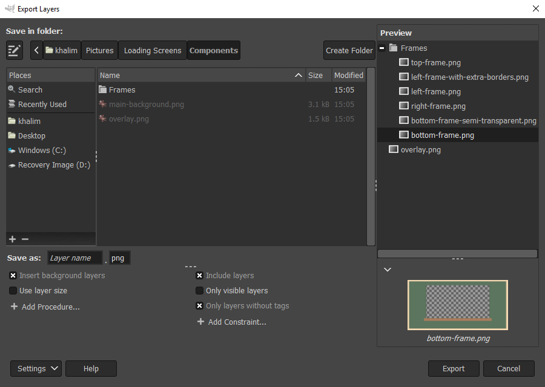

* TOC
{:toc}

Getting Started with Customization
----------------------------------

Beyond the basic features, Export Layers allows you to:
* customize the layer name,
* apply additional procedures before the export (insert background, scale down, ...),
* selecting which layers to export by applying constraints (only visible layers, ...),
* customize export to save multi-layer images (e.g. multi-page PDFs).

To enable customization, press the `Settings` button and select `Show More Settings`.

You may adjust the height of the bottom pane by dragging the separator above the procedures and constraints.

As the amount of customization may be overwhelming at first, you may want to take a look at a few [examples](#examples) below to help you get accustomed to the plug-in's features.

Examples
--------

**I want to export all layers using the image size, not the layer size.**

Uncheck or remove the "Use layer size" procedure.

**I want to export only visible layers.**

Check the "Visible" constraint (or add one if not already).

**I don't want to preserve folder hierarchy when exporting layers.**

Add the "Ignore folder structure" procedure.

**How do I rename the layers to form a sequence of numbers, e.g. "image001", "image002", ...?**

Click on the text entry next to `Save as:` and choose `image001`, or type `image[001]` in the entry.

**My layers contain a '.'. All characters after the '.' are replaced with the file extension. How do I prevent this?**

In the text entry next to `Save as:`, type `[layer name, %e]`.
This ensures that the resulting image name will be e.g. `some.layer.png` instead of `some.png` (the default behavior).

**How do I export only layer groups at the top level?**

1. Uncheck the "Layers" constraint.
2. Add the "Layer groups" constraint.
3. Add the "Top-level" constraint.

**I want to adjust brightness in my layers before export. Can this be done?**

Yes, you may insert any GIMP filter as a procedure:
1. Select `Add Procedure...` → `Add Custom Procedure...`
2. Find `gimp-brightness-contrast` in the procedure browser and select `Add`.
3. Adjust the parameters as desired.
4. Select `OK` to add the procedure.

**I need every layer to have the same background.**

1. In the preview to the right, right-click on the layer name you want to be your background.
2. Check `Background`. A tag icon will be displayed next to the layer name.
3. To add more layers as background, repeat steps 1 and 2. If you need to achieve a particular order of background layers, you need to reorder the layers in GIMP (i.e. outside the plug-in). The plug-in will sync with the changes done in GIMP.
4. Add the "Insert background layers" procedure. If needed, you may place this procedure after "Use layer size" by dragging it above/onto "Use layer size".

**I want to save the image as a multi-page PDF file.**

While multi-page PDF export is already possible in GIMP without any plug-ins, Export Layers allows you to apply custom procedures before the export or export each layer group (instead of the entire image).

1. Add the "Export" procedure.
2. Type `pdf` next to `File extension`.
3. Select an option in `Perform export:`. To export a single image, select `For the entire image at once`.
4. If needed and if `For the entire image at once` was selected, adjust `Image filename pattern` as seen fit.
5. Specifically for the PDF format, you need to check `Layers as pages` when the native PDF export dialog is shown. Otherwise, only a single page will be exported.
6. You may also want to uncheck the "Use layer size" procedure to use the image size (since PDF pages have the same dimensions), otherwise you might obtain unexpected results.

Also note that if you export top-level layer groups and the first layer group contains only a single layer, the `Layers as pages` option in the PDF dialog cannot be checked, even if subsequent layer groups contain multiple layers. This is the current behavior of the PDF export in GIMP (at least in GIMP 2.10).

Customizing Layer Names
-----------------------

By default, layer names are used as filenames.
The text entry next to `Save as` lets you customize the filenames.

There are several built-in *fields* that you can combine to form a filename pattern.
For example, `image[001]` renames the layers to `image001`, `image002` and so on.
The text entry can show you examples of how each field is used if you place the text cursor inside a field.
The fields are described below in detail.

The preview automatically updates as you change the filename pattern and so can greatly help you figure out how your specified pattern affects the layer names.

Fields must be enclosed in square brackets and must have a correct number of arguments.
Arguments must be separated by commas.
Invalid arguments result in the field being inserted literally.

### Available fields

You can choose the fields from the dropdown list displayed when clicking on the text entry or you can type the fields manually.

**Number**

A number incrementing for each layer.
The numbering is separate for each layer group.

Arguments:
* `%n` - Continue numbering across layer groups.
* `%d<number>` - Use descending numbers, optionally with the specified padding (number of digits).
If the number is 0, the first number is the number of layers to export within a layer group, or, if `%n` is also specified, the number of all layers to export.

Examples:
* `[1]` → `1`, `2`, ...
* `[001]` → `001`, `002`, ..., `009`, `010`, ..., `999`, `1000`, ...
* `[005]` → `005`, `006`, ...
* `[001, %n]` → `001`, `002`, ... (continues numbering across layer groups)
* `[000, %d]` → `010`, `009`, ... (if the number of layers is 10)
* `[10, %d2]` → `10`, `09`, ...

**\[layer name\]**

The layer name.

Arguments:
* *file extension strip mode*:
	* `%e`: If a layer has a recognized file extension, keep the extension.
	* `%i`: If a layer has a recognized file extension that matches the one in the `File extension` text entry, keep the extension.

Examples:
* `[layer name]` → `Frame.png`
* `[layer name, %e]` → `Frame.png`
* `[layer name, %i]` → `Frame.png` (if the file extension is `png`)
* `[layer name, %i]` → `Frame` (if the file extension is `jpg`)

**\[image name\]**

The current image name.

Arguments:
* `%e`: If the image has a file extension, keep the extension.

Examples:
* `[image name]` → `Image`
* `[image name, %e]` → `Image.xcf`

**\[layer path\]**

The "full path" of a layer.
For example, if the image has a layer group named `Body` containing a layer group named `Hands` containing a layer named `Left`, the layer path will be `Body-Hands-Left`.

Arguments:
* *separator*: A string separating the path components.
  Defaults to `-`.
* *wrapper*: A string that wraps around each path component.
  The wrapper must contain `%c` denoting the path component.
  Defaults to `%c`.
* *file extension strip mode*:
	* `%e`: If a layer has a recognized file extension, keep the extension.
	* `%i`: If a layer has a recognized file extension that matches the one in the `File extension` text entry, keep the extension.

Examples:
* `[layer path]` → `Body-Hands-Left`
* `[layer path, _]` → `Body_Hands_Left`
* `[layer path, _, (%c)]` → `(Body)_(Hands)_(Left)`
* `[layer path, _, (%c), %e]` → `Body-Hands-Left.png` (if the layer name is `Left.png` and the file extension is `png`)
* `[layer path, _, (%c), %i]` → `Body-Hands-Left.png` (if the layer name is `Left.png` and the file extension is `png`)
* `[layer path, _, (%c), %i]` → `Body-Hands-Left` (if the layer name is `Left.png` and the file extension is e.g. `jpg`)

**\[replace\]**

Replaces a part of the specified field with another string.
This essentially allows to fine-tune any field.
Regular expressions are supported as well.

Arguments:
* *field name*: Any recognized field described in this section, except "Number".
The field can be specified with arguments; if so, enclose the field in square brackets (`[` and `]`).
* *pattern*: Part of the field to replace.
The pattern can also be a regular expression using the same syntax as defined for the [`re` module for Python](https://docs.python.org/2/library/re.html).
* *replacement*: Contents that should replace *pattern*.
The replacement can also be a regular expression using the same syntax as defined for the [`re` module for Python](https://docs.python.org/2/library/re.html).
* (optional) *count*: Number of replacements to perform if the pattern matches multiple parts.
If 0, perform replacements for all parts.
* (optional) *flags*: Flags further adjusting how the replacement should be performed.
Flags are specified in the [`re` module for Python](https://docs.python.org/2/library/re.html).
Use the name without the `re.` prefix.
For example, to ignore case, type `IGNORECASE` or `ignorecase`.
You can specify multiple flags separated by commas.

For the example below, suppose that a layer is named "Animal copy #1".
While the square brackets (`[` and `]`) enclosing the first three field arguments are optional, they are necessary in case you need to specify an empty string (`[]`), leading spaces or commas.

Examples:
* `[replace, [layer name], [a], [b] ]` → `Animbl copy #1`
* `[replace, [layer name], [a], [b], 1, ignorecase]` → `bnimal copy #1`,
* `[replace, [layer name], [ copy(?: #[[0-9]]+)*$], [] ]` → `Animal`,

**\[tags\]**

All tags assigned to a layer.
For example, suppose that a layer has the following tags: `left`, `middle`, `right`.
Then (by default) the tags will be formatted as `left-middle-right`.

Without arguments, tags are inserted in alphabetical order.

See [Tagging Layers](#tagging-layers) for information about layer tags.

Arguments:
* *separator*: A string separating the tags.
  Defaults to `-`.
* *wrapper*: A string that wraps around each tag.
  The wrapper must contain `%t` denoting the tag.
* *tags...*: Specific tag names as comma-separated arguments.
  If omitted, all tags are inserted.
  Tags not assigned to a layer are ignored.

If at least two arguments are specified and the second argument contains `%t`, then the first argument is considered to be the *separator* argument and the second argument the *wrapper* argument.

Examples:
* `[tags]` → `left-middle-right`
* `[tags, right, left]` → `right-left`
* `[tags, _, (%t)]` → `(left)_(middle)_(right)`
* `[tags, _, (%t), right, left]` → `(right)_(left)`

**\[current date\]**

The current date.

Arguments:
* *format*: Date format as per the [Python `strftime` function](http://strftime.org/).
  Defaults to `%Y-%m-%d` (year-month-day).

Examples:
* `[current date]` → `2019-01-28`
* `[current date, %m.%d.%Y_%H-%M]` → `28.01.2019_19-04`

**\[attributes\]**

Layer or image attributes.

Arguments
* *pattern*: A string formatting the attributes.
  Available attributes:
  * `%w` - The layer width.
  * `%h` - The layer height.
  * `%x` - The layer *x*-offset.
  * `%y` - The layer *y*-offset.
  * `%iw` - The image width.
  * `%ih` - The image height.
* *measure*: The measure in which the attribute values are displayed.
  Applies to `%w`, `%h`, `%x` and `%y` only.
  Available measures:
  * `%px` (default) - Display absolute values in pixels.
  * `%pc` - Display percentages relative to the image.
    A number may be included after `%pc` to specify the number of digits to round to (2 by default).
    For example, `%pc1` displays percentages rounded to a single decimal digit.

Examples:
* `[attributes, %w-%h-%x-%y]` → `1000-270-0-40`
* `[attributes, %w-%h-%x-%y, %pc]` → `1.0-0.54-0.0-0.08`
* `[attributes, %w-%h-%x-%y, %pc1]` → `1.0-0.5-0.0-0.1`
* `[attributes, %iw-%ih]` → `1000-500`

### Inserting reserved characters in arguments

To insert a literal space or comma in a field argument, enclose the argument with square brackets.
To insert a literal square bracket (`[` or `]`), double the bracket and enclose the argument with square brackets (e.g. `[[[]` to insert a literal `[`).

If the last argument is enclosed in square brackets, leave a single space between the last and the second to last closing square bracket.

Examples:
* `[layer path, [ ] ]` → `Body Hands Left`
* `[layer path, [,], [[[%c]]] ]` → `[Body],[Hands],[Left]`

Customizing Export with Procedures
----------------------------------

Procedures allow you to process layers before they are exported.
To add procedures before the export of each layer, press the `Add Procedure...` button and select one of the available procedures, or add a [custom procedure](#Adding-Custom-Procedures).

For each added procedure, you may perform any of the following:
* enable and disable the procedure,
* move the procedure up/down by dragging the procedure with mouse or by keyboard,
* edit the procedure.
  You may edit the name and the values of its arguments (if any) that are applied to each layer.
* remove the procedure.

You can add the same procedure multiple times.

### Built-in Procedures

**Export**

Performs export with additional customization not available in the main dialog.

Options:
* *File extension*: File extension of the output image.
  This overrides the file extension in the main dialog.
* *Perform export*: Whether to export each layer separately ("For each layer"), each top-level layer or layer group separately ("For each top-level layer or group"), or a single image containing all layers ("For the entire image at once").
  The latter two options provide multi-layer export. This allows exporting e.g. multi-page PDFs or animated GIFs per top-level layer group and/or with additional custom procedures applied before the export.
* *Image filename pattern*: Filename pattern available when a single image is exported (the "Entire image at once" option is selected).
  The text entry next to `Save as` still applies to individual layer names (since some multi-layer file formats also store layer names, e.g. TIFF or PSD).
* *Use file extension in layer name*: If a layer name has a recognized file extension, use that file extension instead of the one in the `File extension` text entry.
  You very likely need to type `[layer name, %e]` in the text entry next to `Save as` to preserve file extensions in layer names.
* *Convert file extension to lowercase*: File extensions in layer names are converted to lowercase.
* *Preserve layer name after export*: If enabled, layer names will revert to the state before export (i.e. without adding a file extension to them).
  This is probably only ever useful if you want to perform export multiple times, e.g. with multiple different file formats (which is possible by adding multiple Export procedures).

When exporting each layer separately (the default), the Export procedure usually makes sense to be applied as the last procedure since procedures after Export would have no effect.

**Ignore folder structure**

Export all layers to the output directory on the same level, i.e. do not create subfolders for layer groups.

**Inherit transparency from layer groups**

Combine opacity from all parent layer groups for each layer.
This corresponds to how the layer is actually displayed in the image canvas.

For example, if a layer has 50% opacity and its parent group also has 50% opacity, the resulting opacity of the exported layer will be 25%.

**Insert background layers**

Insert layers tagged with `Background` as background for each layer.
To set a layer as a background layer, see [Tagging Layers](#tagging-layers).

Note that even background layers get exported - to prevent this behavior, enable the `Without tags` constraint.

You may modify the tag representing the background layers by editing the procedure argument `Tag`.

In the dialog, this procedure is always inserted in the first position.
This prevents potential confusion when `Use layer size` is unchecked and the background is offset relative to the layer rather than the image canvas.
If this is your intention, you can always move this procedure below `Use layer size`.

**Insert foreground layers**

Insert layers tagged with `Foreground` as foreground for each layer.
To set a layer as a foreground layer, see [Tagging Layers](#tagging-layers).

Note that even foreground layers get exported - to prevent this behavior, enable the `Without tags` constraint.

You may modify the tag representing the foreground layers by editing the procedure argument `Tag`.

In the dialog, this procedure is always inserted in the first position.
This prevents potential confusion when `Use layer size` is unchecked and the foreground is offset relative to the layer rather than the image canvas.
If this is your intention, you can always move this procedure below `Use layer size`.

**Rename layer**

Rename a layer according to the specified pattern.
This procedure uses the same text entry for patterns as the one next to `Save as` (as described in [Customizing Layer Names](#customizing-layer-names)).
If this procedure is specified, the text entry next to `Save as` has no effect.

Additionally, this procedure allows customizing whether to also rename folders (by enabling `Rename folders`) or only rename folders (by enabling `Rename folders` and disabling `Rename layers`).

**Use layer size**

If enabled, layers will be resized (not scaled) to their size instead of the image size.
This procedure is enabled by default.

To keep the size of the image canvas and the layer position within the image, disable this setting.
Note that in that case the layers will be cut off if they are partially outside the image canvas.
To export the entire layer, leave this setting enabled.

### Adding Custom Procedures 

You can add any procedure available in the GIMP Procedural Database (PDB) by pressing `Add Procedure...` and then selecting `Add Custom Procedure...`.
Select the desired procedure from the browser dialog and press `Add`.
The edit dialog allows you to edit the procedure name and the values of its arguments.

### Editing procedures

When editing a procedure, you may (and sometimes have to) adjust its arguments.
GIMP PDB procedures are usually accompanied with descriptions of the entire procedure as well as its arguments.
Hover over argument names to display tooltips describing them in more detail.
The description for an argument often indicates the range of valid values.

If a procedure contains a layer/drawable/item argument, you may select one of the following:
* (default) "Current Layer" - applies the procedure to the currently processed layer.
* "Background" - applies the procedure to layer placed after the current layer (i.e. the background), usually created via the "Insert background layers" procedure. Careful, if there is no such layer, the export will fail.
* "Foreground" - applies the procedure to layer placed before the current layer (i.e. the foreground), usually created via the "Insert foreground layers" procedure. Careful, if there is no such layer, the export will fail.

### More options

When editing a procedure or a constraint, you may expand `More options` for further customization.
Options under `More options` are described below.

**Enable for previews**

If checked, the procedure is applied to previews.
You may want to uncheck this if a procedure is very slow or e.g. manipulates the file system (reads or saves files).

Selecting Layers to Export with Constraints
-------------------------------------------

To include or exclude layers from the export according to specific criteria, press the `Add Constraint...` button and select one of the available constraints.
As with procedures, you can enable, disable, reorder, edit or remove constraints as needed.
Adding the same constraint multiple times is also possible.

Currently, only several built-in constraints are supported.
Future versions will allow specifying custom constraints.

### Built-in Constraints

**Layers**

Export only layers (i.e. not layer groups).
This constraint is enabled by default.

**Layer groups**

Export only layer groups.

**Visible**

If enabled, invisible layers will not be exported.
Visible layers within invisible layer groups will also not be exported.

**Top-level**

Export only layers at the top of the layer tree (i.e. do not export layers inside any layer group).

**With tags**

Export only layers with tags.

By default, all layers without tags are excluded from export.
To export only layers with specific tags, edit this constraint and add the tags for the `Tags` argument.
For example, adding `background` will export only layers containing the `background` tag.
Other tagged layers will be excluded.

See [Tagging Layers](#tagging-layers) for information about tags.

**Without tags**

Export only layers with no tags.

By default, all layers with tags are excluded from export.
To ignore only specific tags, edit this constraint and add the tags for the `Tags` argument.

See [Tagging Layers](#tagging-layers) for information about tags.

**Matching file extension**

Export only layers having a file extension matching the extension typed in the text entry.

**Selected in preview**

Export only layers selected in the preview.
If you save settings, the selection is saved as well.

Tagging Layers
--------------

Tags attached to layers allow you to customize each layer individually.
To attach a tag to one or more layers, select them in the preview, right-click on the selection and choose your tag.
Tagged layers are indicated with a tag icon in the preview.

Adding or removing tags modifies the current image.
Save the image to keep the tags permanently.

By default, Export Layers defines `Background` and `Foreground` tags.
To add custom tags, right-click anywhere on the preview, select `Add New Tag...` and name your new tag.
The new tag will be immediately added to the currently selected layer(s).

To remove custom tags, remove them first from all layers, then right-click anywhere on the preview, select `Remove Tag...` and select the tag you wish to remove.
