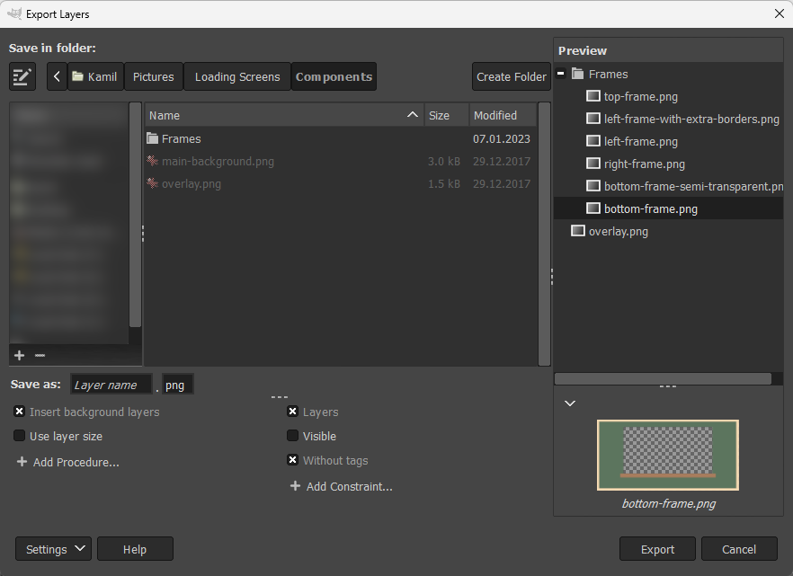

Introduction
------------

Beyond the basic features, Export Layers allows you to:
* customize the layer name,
* apply additional procedures before the export (insert background, scale down...)
* exclude specific layers from the export by applying constraints (only visible layers, ...)

To enable customization, press the "Settings" button and choose "Show More Settings".

You may adjust the height of the bottom pane by dragging the separator above the procedures and constraints.

Customizing Layer Names
-----------------------

By default, layer names are used as filenames.
The text entry next to "Save as" lets you customize the filenames.

There are several built-in *fields* that you can combine to form a filename pattern.
For example, "image\[001\]" renames the layers to "image001", "image002" and so on.

The preview automatically updates as you change the filename pattern and so can greatly help you figure out how your specified pattern affects the layer names.

Fields must be enclosed in square brackets and must have a correct number of arguments.
If you place the text cursor inside a field, a corresponding tooltip above the text entry shows you the name and the number of possible arguments.

Arguments must be separated by commas.
Arguments in italic are optional.
Arguments with slashes indicates a single choice of one of the specified values.
Invalid arguments result in the field being inserted literally.

### Available fields

You can choose the fields from the dropdown list displayed when clicking on the text entry or you can type the fields manually.

**\[number\]**

A number incrementing for each layer.
The numbering is separate for each layer group.

Examples:
* \[1\] → 1, 2, ...
* \[001\] → 001, 002, ..., 009, 010, ..., 999, 1000, ...
* \[005\] → 005, 006, ...

**\[layer name\]**

The layer name.

Arguments:
* "keep extension": If a layer has a recognized file extension, don't remove it.
* "keep only identical extension": If a layer has a recognized file extension and it matches the extension in the "File extension" text entry, don't remove it.

**\[image name\]**

The current image name.

Arguments:
* "keep extension": Do not remove the file extension of the image if it has one.

**\[layer path\]**

The "full path" of a layer.
For example, if the image has a layer group named "Frames" and the layer group has a layer named "Top", the path for the layer will be "Frames-Top".

Arguments:
* path separator: A string that separates the path components.
  Defaults to "-".
* wrapper: A string that wraps around each path component.
  The wrapper must contain "$$" (denoting the name of the current path component).
  By default, no wrapper is used.

Examples:
* Suppose that a layer has the following path: Frames, Outer, bottom.
* [layer path] → Frames-Outer-bottom
* [layer path, \_] → Frames\_Outer\_bottom
* [layer path, \_, ($$)] → (Frames)\_(Outer)\_(bottom)

**\[tags\]**

All tags of a layer.
By default, tags are inserted in the following format:
"\[\<tag1\>\] \[\<tag2\>\] ..."

Tags are inserted in alphabetical order.
See [Tagging Layers](#tagging-layers) for information about layer tags.

Arguments:
* if there are two arguments and the second argument contains "$$", then the first argument is a separator between tags and the second argument acts as a "wrapper" around the tag name.
* specific tags: tag names as comma-separated arguments.
  If omitted, all tags are inserted.

Examples:
* Suppose that a layer has the following tags: Background, Foreground, frames.
* [tags] → \[Background\] \[Foreground\] \[frames\]
* [tags, Background, Foreground] → \[Background\] \[Foreground\]
* [tags, \_, ($$)] → (Background)\_(Foreground)\_(frames)
* [tags, \_, ($$), Background, Foreground] → (Background)\_(Foreground)

**\[current date\]**

The current date.

Arguments:
* date format: Date format as per the [Python `strftime` format](http://strftime.org/).
  Defaults to "%Y-%m-%d" (year-month-day).

### Inserting reserved characters in arguments

To insert a literal space, comma or square brackets ("\[" and "\]") in an argument, enclose the argument with square brackets.
Literal square brackets must be doubled.

If the last argument is enclosed in square brackets, leave a single space between the last and the second to last closing square bracket.

Examples:
* [layer path, [ ], $$]
* [layer path, [ ] ]
* [layer path, [,], [[[$$]]] ]

Additional Procedures
---------------------

To add custom procedures before the export of each layer, press the "Add Procedure..." button and select one of the procedures described below.
You can enable, disable or remove procedures as needed.
You can add the same procedure multiple times.

**Insert background layers**

Insert layers tagged with "Background" as background for each layer.
To set a layer as a background layer, see [Tagging Layers](#tagging-layers).
Note that even background layers get exported - to prevent this behavior, enable the "Only layers without tags" constraint.

In the dialog, this procedure is always inserted in the first position.
This prevents potential confusion when "Use layer size" is unchecked and the background is offset relative to the layer rather than the image canvas.
If this is your intention, you can always move this procedure below "Use layer size".

**Insert foreground layers**

Insert layers tagged with "Foreground" as foreground for each layer.
See the "Insert background layers" setting for more information.

In the dialog, this procedure is always inserted in the first position.
This prevents potential confusion when "Use layer size" is unchecked and the foreground is offset relative to the layer rather than the image canvas.
If this is your intention, you can always move this procedure below "Use layer size".

**Inherit transparency from layer groups**

Combine opacity from all parent layer groups for each layer.
This corresponds to how the layer is actually displayed in the image canvas.

For example, if a layer has 50% opacity and its parent group also has 50% opacity, the resulting opacity of the exported layer will be 25%.

**Autocrop background**

Automatically crop the background formed by layers tagged with "Background".
Note that autocrop is performed on the entire background, not on the background layers individually.

**Autocrop foreground**

Same as "Autocrop background", but works on the foreground layers instead.

**Use file extensions in layer names**

If a layer has a recognized file extension, use that file extension instead of the file extension in the "File extension" text entry.

**Use layer size**

If enabled, layers will be resized (not scaled) to their size instead of the image size. This procedure is enabled by default.

To keep the size of the image canvas and the layer position within the image, disable this setting.
Note that in that case the layers will be cut off if they are partially outside the image canvas.
To export the entire layer, leave this setting enabled.

Additional Constraints
----------------------

To include or exclude layers according to specific criteria, press the "Add Constraint..." button and select one of the constraints described below.
You can enable, disable or remove constraints as needed.
You can add the same constraint multiple times.

**Include layers**

Export all layers that are not groups.
This constraint is enabled by default.

**Include layer groups**

Export all layer groups.

**Include empty layer groups**

Create subfolders for empty layer groups.

**Only visible layers**

If enabled, invisible layers will not be exported.
Visible layers within invisible layer groups will also not be exported.

**Only top-level layers**

Export only layers at the top of the layer tree (i.e. do not export layers inside any layer group).

**Only layers with tags**

Export only layers with tags.
See [Tagging Layers](#tagging-layers) for information about tags.

**Only layers without tags**

Export only layers with no tags.
See [Tagging Layers](#tagging-layers) for information about tags.

**Only layers matching file extension**

Export only layers having a file extension matching the extension typed in the text entry.

**Only layers selected in preview**

Export only layers selected in the preview.
If you save settings, the selection is saved as well.

Tagging Layers
--------------

Tags attached to layers allow you to customize each layer individually.
To attach a tag to one or more layers, select them in the preview, right-click on the selection and choose your tag.
Tagged layers are indicated with a tag icon in the preview.

Adding or removing tags modifies the current image.
Save the image to keep the tags permanently.

By default, Export Layers defines "Background" and "Foreground" tags.
To add custom tags, right-click anywhere on the preview, select "Add New Tag..." and name your new tag.
The new tag will be immediately added to the currently selected layer(s).

To remove custom tags, remove them first from all layers, then right-click anywhere on the preview, select "Remove Tag..." and select the tag you wish to remove.
