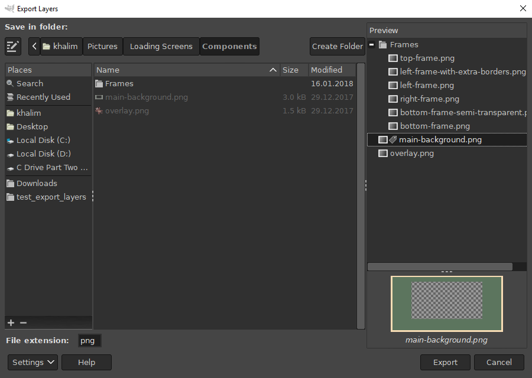

Basic Usage
-----------

Open your image in GIMP and select "File → Export Layers...".
A dialog that appears allows you to choose the output folder and file extension.

To export layers, press the "Export" button.
A dialog corresponding to the file format appears, allowing you to adjust export settings.
Some file formats do not display dialogs, while some display the dialog for each layer (this cannot be prevented because such a file format only allows an interactive export).

Repeating Last Export
---------------------

If you made changes to your image and you want to export again with the same settings, you can do so simply by running "File → Export Layers (repeat)".

Changing File Extension
-----------------------

Type or choose your desired file extension in the "File extension" text entry.
The dropdown list displays available file formats alongside their associated file extensions.
If a file format contains multiple file extensions, the first is selected by default, but you may also choose from the other extensions (by clicking or pressing Tab).

For now, the dropdown only contains a fixed list of file formats provided by GIMP and some recognized third-party plug-ins.
However, you may still enter a file extension not in the list in case you use a file format plug-in not recognized by Export Layers.

Preview
-------

To have a better grasp of what layers are actually exported and how, the preview displays the layer names in a folder structure.
If you select a layer, the layer contents will be displayed at the bottom of the preview.

You can adjust the width of the entire preview by dragging the separator between the preview and the folder chooser.
You can also adjust the height of the previewed image by dragging the separator above the image.

If the previewed image takes too long to render, the preview is no longer updated automatically.
A button next to the arrow button above the image is displayed that allows you to manually update the image.
To switch between automatic and manual update, click on the arrow button and select "Update Preview Automatically".

Managing Settings
-----------------

After a successful export, your settings (output folder, file extension, dialog position and size, etc.) are preserved while GIMP is running.
If you close GIMP, the settings will be reset.

To save settings permanently, press the "Settings" button and choose "Save Settings".

To reset settings to their default values, press the "Settings" button and choose "Reset Settings".

More Customization
------------------

If you find yourself in the need of customizing layer names, applying additional procedures before exporting or excluding specific layers from the export, see [Customizing Export](Customizing-Export.md).
