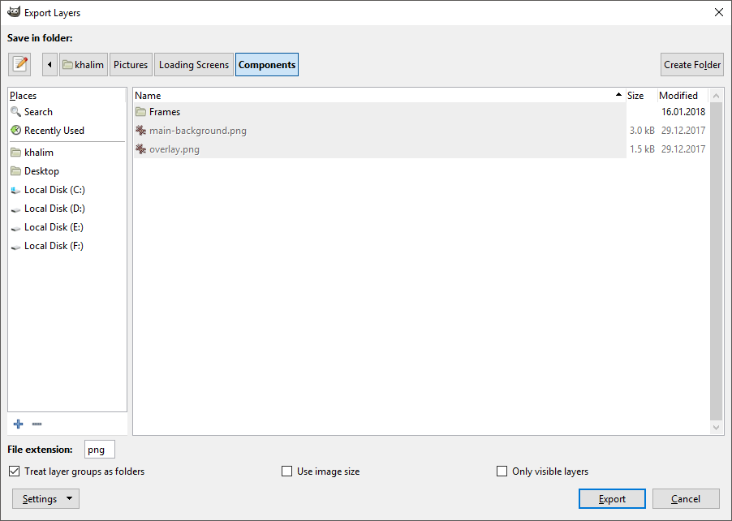

Basic Usage
-----------

Once you open an image in GIMP, select "File -> Export Layers...". A dialog
appears, allowing you to specify output folder and
[a few basic settings](#basic-settings):

To export layers, press the "Export" button. A dialog corresponding to the file
format appears, allowing you to adjust export settings. Some file formats don't
have dialogs, while some file formats display the dialog for each layer (this
can't be prevented because the file format only allows an interactive export).

By default, layer names are used as filenames. To customize this behavior, see
[Customizing Layer Names](Advanced-Usage.md#customizing-layer-names).

Repeating Last Export
---------------------

If you made changes to your image and want to export again with the same
settings, you can do so with just one click by running
"File -> Export Layers (repeat)".

Basic Settings
--------------

**File extension**

Type or choose your desired file extension in the "File extension" text entry.
The dropdown list can help you choose the right file format/extension. For now,
the dropdown list only contains a fixed list of file formats provided by GIMP
and some recognized third-party plug-ins, but you can you can still enter a file
extension not in the dropdown list in case you use a file format plug-in not
recognized by Export Layers.

**Treat layer groups as folders**

If enabled, layers will be exported to subfolders corresponding to the layer
groups. If disabled, all layers will be exported to the output folder on the
same level and no subfolders will be created.

**Only visible layers**

If enabled, invisible layers will not be exported. Visible layers within
invisible layer groups will also not be exported.

**Use image size**

If enabled, layers will be resized (not scaled) to the image size. This is
useful if you want to keep the size of the image canvas and the layer position
within the image. If layers are partially outside the image canvas,
they will be cut off. If you want to export the entire layer,
leave this setting disabled.

Managing Settings
-----------------

After a successful export, your settings are preserved while GIMP is open. This
means that if you close GIMP, the settings will be reset.

To save settings permanently, press the "Settings" button and choose
"Save Settings".

To reset settings to their default values, press the "Settings" button and
choose "Reset Settings".

More settings
-------------

If you need to further customize the export, see
[Advanced Usage](Advanced-Usage.md).
