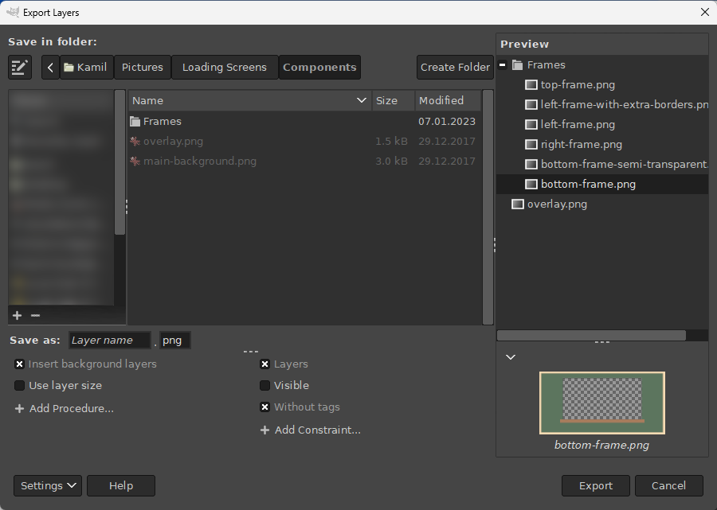

* TOC
{:toc}

Introduction
------------

Beyond the basic features, Export Layers allows you to:
* customize the layer name,
* apply additional procedures before the export (insert background, scale down...)
* selecting which layers to export by applying constraints (only visible layers, ...)

To enable customization, press the "Settings" button and choose "Show More Settings".

You may adjust the height of the bottom pane by dragging the separator above the procedures and constraints.

Customizing Layer Names
-----------------------

By default, layer names are used as filenames.
The text entry next to "Save as" lets you customize the filenames.

There are several built-in *fields* that you can combine to form a filename pattern.
For example, "image\[001\]" renames the layers to "image001", "image002" and so on.

The preview automatically updates as you change the filename pattern and so can greatly help you figure out how your specified pattern affects the layer names.

Fields must be enclosed in square brackets and must have a correct number of arguments.
If you place the text cursor inside a field, a corresponding tooltip above the text entry shows you the correct usage along with examples.

Arguments must be separated by commas.
Invalid arguments result in the field being inserted literally.

### Available fields

You can choose the fields from the dropdown list displayed when clicking on the text entry or you can type the fields manually.

**Number**

A number incrementing for each layer.
The numbering is separate for each layer group.

Examples:
* `[1]` → `1`, `2`, ...
* `[001]` → `001`, `002`, ..., `009`, `010`, ..., `999`, `1000`, ...
* `[005]` → `005`, `006`, ...

**\[layer name\]**

The layer name.

Arguments:
* `%e` If a layer has a recognized file extension, keep the extension.
* `%i`: If a layer has a recognized file extension that matches the extension in the "File extension" text entry, keep the extension.

**\[image name\]**

The current image name.

Arguments:
* `%e`: If the image has a file extension, keep the extension.

**\[layer path\]**

The "full path" of a layer.
For example, if the image has a layer group named `Body` containing a layer group named `Hands` containing a layer named `Left`, the layer path will be `Body-Hands-Left`.

Arguments:
* *separator*: A string separating the path components.
  Defaults to `-`.
* *wrapper*: A string that wraps around each path component.
  The wrapper must contain `%c` denoting the path component.
  Defaults to `%c`.

Examples:
* `[layer path]` → `Body-Hands-Left`
* `[layer path, _]` → `Body_Hands_Left`
* `[layer path, _, (%c)]` → `(Body)_(Hands)_(Left)`

**\[tags\]**

All tags assigned to a layer.
For example, suppose that a layer has the following tags: `left`, `middle`, `right`.
Then (by default) the tags will be formatted as `left-middle-right`.

Without arguments, tags are inserted in alphabetical order.

See [Tagging Layers](#tagging-layers) for information about layer tags.

Arguments:
* *separator*: A string separating the tags.
  Defaults to `-`.
* *wrapper*: A string that wraps around each path component.
  The wrapper must contain `%t` denoting the tag.
* *tags...*: Specific tag names as comma-separated arguments.
  If omitted, all tags are inserted.
  Tags not assigned to a layer are ignored.

If at least two arguments are specified and the second argument contains `%t`, then the first argument is considered to be the *separator* argument and the second argument the *wrapper* argument.

Examples:
* `[tags]` → `left-middle-right`
* `[tags, right, left]` → `right-left`
* `[tags, _, (%t)]` → `(left)_(middle)_(right)`
* `[tags, _, (%t), right, left]` → `(right)_(left)`

**\[current date\]**

The current date.

Arguments:
* *format*: Date format as per the [Python `strftime` function](http://strftime.org/).
  Defaults to `%Y-%m-%d` (year-month-day).

Examples:
* `[current date]` → `2019-01-28`
* `[current date, %m.%d.%Y_%H-%M]` → `28.01.2019_19-04`

**\[attributes\]**

Layer or image attributes.

Arguments
* *pattern*: A string formatting the attributes.
  Available attributes:
  * `%w` - The layer width.
  * `%h` - The layer height.
  * `%x` - The layer *x*-offset.
  * `%y` - The layer *y*-offset.
  * `%iw` - The image width.
  * `%ih` - The image height.
* *measure*: The measure in which the attribute values are displayed.
  Applies to `%w`, `%h`, `%x` and `%y` only.
  Available measures:
  * `%px` (default) - Display absolute values in pixels.
  * `%pc` - Display percentages relative to the image.
    A number may be included after `%pc` to specify the number of digits to round to (2 by default).
    For example, `%pc1` displays percentages rounded to a single decimal digit.

Examples:
* `[attributes, %w-%h-%x-%y]` → `1000-500-0-40`
* `[attributes, %w-%h-%x-%y, %pc1]` → `1.0-0.8-0.0-0.1`

### Inserting reserved characters in arguments

To insert a literal space, comma or square brackets (`[` and `]`) in an argument, enclose the argument with square brackets.
Literal square brackets must be doubled.

If the last argument is enclosed in square brackets, leave a single space between the last and the second to last closing square bracket.

To insert a literal `%` character, double the character.

Examples:
* `[layer path, [ ], %c]` → `Body Hands Left`
* `[layer path, [ ] ]` → `Body Hands Left`
* `[layer path, [ ], %%%c%%]` → `%Body% %Hands% %Left%`
* `[layer path, [,], [[[%c]]] ]` → `[Body],[Hands],[Left]`

Customizing Export with Procedures
----------------------------------

Procedures allow you to process layers before they are exported.
To add procedures before the export of each layer, press the "Add Procedure..." button and select one of the available procedures, or add a [custom procedure](#Adding-Custom-Procedures).

For each added procedure, you may perform any of the following:
* enable and disable the procedure,
* move the procedure up/down by dragging the procedure with mouse or by keyboard,
* edit the procedure.
  You may edit the name and the values of its arguments (if any) that are applied to each layer.
* remove the procedure.

You can add the same procedure multiple times.

### Built-in Procedures

**Insert background layers**

Insert layers tagged with "Background" as background for each layer.
To set a layer as a background layer, see [Tagging Layers](#tagging-layers).

Note that even background layers get exported - to prevent this behavior, enable the "Only layers without tags" constraint.

You may modify the tag representing the background layers by editing the procedure argument "Tag".

In the dialog, this procedure is always inserted in the first position.
This prevents potential confusion when "Use layer size" is unchecked and the background is offset relative to the layer rather than the image canvas.
If this is your intention, you can always move this procedure below "Use layer size".

**Insert foreground layers**

Insert layers tagged with "Foreground" as foreground for each layer.
To set a layer as a foreground layer, see [Tagging Layers](#tagging-layers).

Note that even foreground layers get exported - to prevent this behavior, enable the "Only layers without tags" constraint.

You may modify the tag representing the foreground layers by editing the procedure argument "Tag".

In the dialog, this procedure is always inserted in the first position.
This prevents potential confusion when "Use layer size" is unchecked and the foreground is offset relative to the layer rather than the image canvas.
If this is your intention, you can always move this procedure below "Use layer size".

**Inherit transparency from layer groups**

Combine opacity from all parent layer groups for each layer.
This corresponds to how the layer is actually displayed in the image canvas.

For example, if a layer has 50% opacity and its parent group also has 50% opacity, the resulting opacity of the exported layer will be 25%.

**Autocrop background**

Automatically crop the background formed by layers tagged with "Background".
Note that autocrop is performed on the entire background, not on the background layers individually.

**Autocrop foreground**

Same as "Autocrop background", but works on the foreground layers instead.

**Ignore folder structure**

Export all layers to the output directory on the same level, i.e. do not create subfolders for layer groups.

**Use file extension in layer name**

If a layer has a recognized file extension, use that file extension instead of the file extension in the "File extension" text entry.

**Use layer size**

If enabled, layers will be resized (not scaled) to their size instead of the image size.
This procedure is enabled by default.

To keep the size of the image canvas and the layer position within the image, disable this setting.
Note that in that case the layers will be cut off if they are partially outside the image canvas.
To export the entire layer, leave this setting enabled.

### Adding Custom Procedures 

You can add any procedure available in the GIMP Procedural Database (PDB) by pressing "Add Procedure..." and then selecting "Add Custom Procedure...".
Select the desired procedure from the browser dialog and press "Add".
The edit dialog allows you to edit the procedure name and the values of its arguments.

Selecting Layers to Export with Constraints
-------------------------------------------

To include or exclude layers from the export according to specific criteria, press the "Add Constraint..." button and select one of the available constraints.
As with procedures, you can enable, disable, reorder, edit or remove constraints as needed.
Adding the same constraint multiple times is also possible.

Currently, only several built-in constraints are supported.
Future versions will allow specifying custom constraints.

### Built-in Constraints

**Include layers**

Export all layers that are not groups.
This constraint is enabled by default.

**Include layer groups**

Export all layer groups as layers.

**Include empty layer groups**

Create subfolders for empty layer groups.

**Only visible layers**

If enabled, invisible layers will not be exported.
Visible layers within invisible layer groups will also not be exported.

**Only top-level layers**

Export only layers at the top of the layer tree (i.e. do not export layers inside any layer group).

**Only layers with tags**

Export only layers with tags.

By default, all layers without tags are excluded from export.
To export only layers with specific tags, edit this constraint and add the tags for the "Tags" argument.
For example, adding "background" will export only layers containing the "background" tag.
Other tagged layers will be excluded.

See [Tagging Layers](#tagging-layers) for information about tags.

**Only layers without tags**

Export only layers with no tags.

By default, all layers with tags are excluded from export.
To ignore only specific tags, edit this constraint and add the tags for the "Tags" argument.

See [Tagging Layers](#tagging-layers) for information about tags.

**Only layers matching file extension**

Export only layers having a file extension matching the extension typed in the text entry.

**Only layers selected in preview**

Export only layers selected in the preview.
If you save settings, the selection is saved as well.

Tagging Layers
--------------

Tags attached to layers allow you to customize each layer individually.
To attach a tag to one or more layers, select them in the preview, right-click on the selection and choose your tag.
Tagged layers are indicated with a tag icon in the preview.

Adding or removing tags modifies the current image.
Save the image to keep the tags permanently.

By default, Export Layers defines "Background" and "Foreground" tags.
To add custom tags, right-click anywhere on the preview, select "Add New Tag..." and name your new tag.
The new tag will be immediately added to the currently selected layer(s).

To remove custom tags, remove them first from all layers, then right-click anywhere on the preview, select "Remove Tag..." and select the tag you wish to remove.
